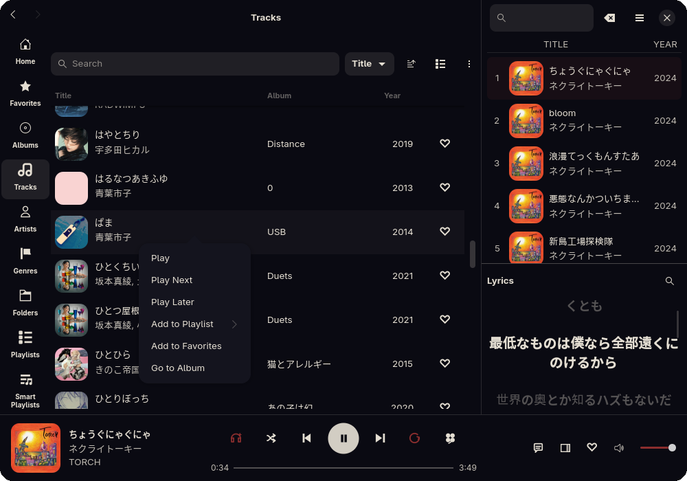
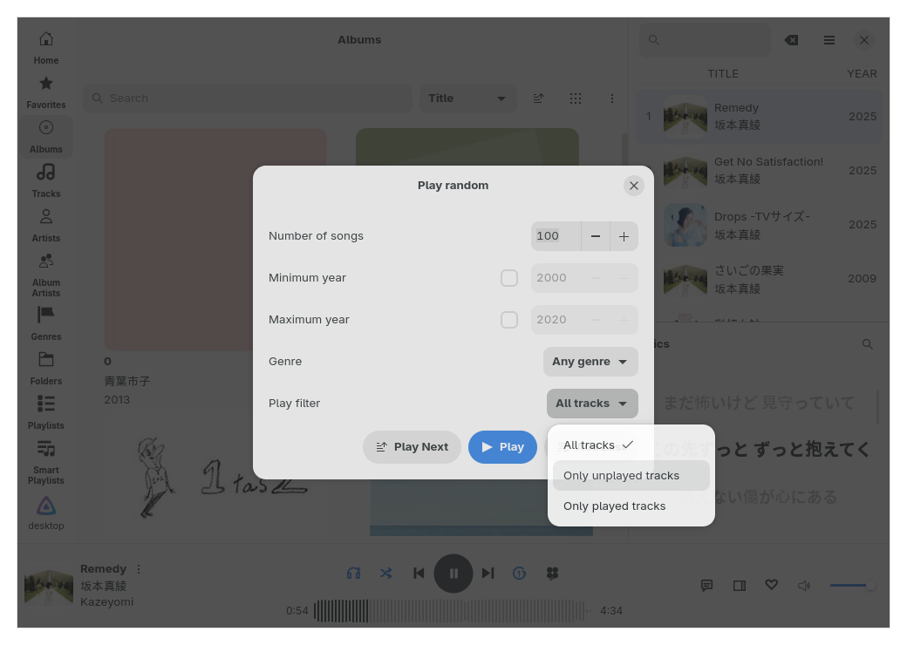
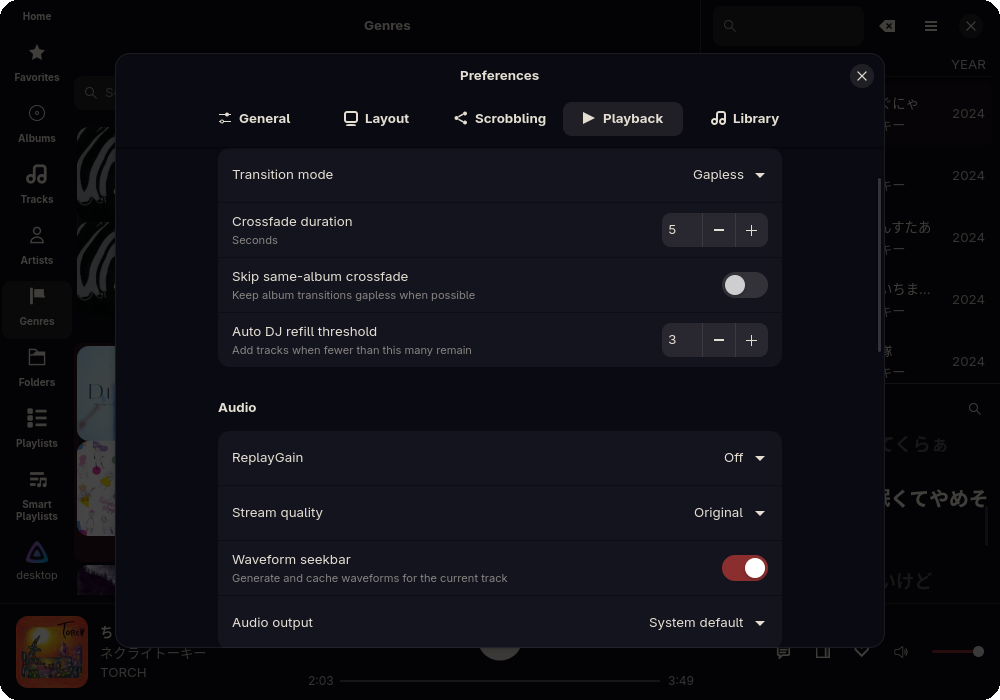

# Rufin

<p align="center">
  <a href="Cargo.toml"></a>
  <a href="LICENSE"></a>
  <a href="https://gitlab.gnome.org/GNOME/libadwaita/"></a>
  <a href="https://flathub.org/apps/io.github.screwys.Rufin"></a>
    <a href="https://aur.archlinux.org/packages/rufin"></a>
  <a href="flake.nix"></a>
</p>

 Rufin is a native GTK4/libadwaita music client written in Rust. It is created to be a fast, lightweight and customizable music client. It supports playback from your music server(s) or your local folder(s), with built-in playback reporting to Last.fm and alike.
<br clear="left">


# Features

- Fast, native and modern GTK/libadwaita client
- Optimized for quick startup and navigation, smooth browsing and type-to-search across large libraries
- Supports playing from Jellyfin, Subsonic, Navidrome servers and local folders
- Local library support with multiple folders and CUE support with separate playable tracks
- Built-in scrobbling for Last.fm, Libre.fm, and ListenBrainz
- Discord Rich Presence support
- Automatic metadata caching for missing lyrics/cover arts
- Gapless playback, crossfade, ReplayGain, equalizer presets and fullscreen player with visualizer
- Best-effort path matching with your music server and local folders, you can play from your local files while keeping server reporting
- Rich customization while preserving GTK menus
- Smart playlists that support nested rules
- System tray integration

# Library behavior

- Rufin keeps a local cache for each source, so opening the app, switching pages and browsing a large library doesn't mean asking the server or scanning folders again for every click. When a library changes, the app tries to update only the changed parts

- Large libraries are normal to browse; tracks, albums, artists, genres and playlists are full pages, they are not paginated

- Rufin stores source IDs, MusicBrainz IDs, sort tags and display names separately. It checks those before falling back to tag text from the same server or folder which helps to put albums on correct artist pages despite tag mismatches

- When a library changes, app tries to update the changed parts instead of making every page reload. Cover arts and artist pictures come from source first and missing ones are tried to fetch online, and artists use album arts as fallback

- If your server library also exists on disk, Rufin can play the local files directly while still reporting to the server

# Screenshots







# Installation

## Flatpak
<p>
  <a href="https://flathub.org/apps/io.github.screwys.Rufin">
    
  </a>
</p>

## AUR

- `rufin` for tagged binary releases, `rufin-git` to track this repository

```bash
yay -S rufin
yay -S rufin-git
```

## Nix

To use Rufin directly without building, run:

```bash
nix run github:screwys/Rufin
```
This downloads the binary through project cache. You can also add it to your profile:

```bash
nix profile install github:screwys/Rufin
```

## Building locally

Refer to [CONTRIBUTING.md](CONTRIBUTING.md)

# Contributing

To contribute code, please see [CONTRIBUTING.md](CONTRIBUTING.md). 

## Translations

You can also contribute by translating the app on [Weblate](https://hosted.weblate.org/projects/rufin/app/)

[](https://hosted.weblate.org/engage/rufin/?utm_source=widget)

# Credits

Built with [GTK 4](https://www.gtk.org/), [libadwaita](https://gitlab.gnome.org/GNOME/libadwaita/), [gtk-rs](https://gtk-rs.org/), [GStreamer](https://gstreamer.freedesktop.org/)

This app is greatly influenced by [Feishin](https://github.com/jeffvli/feishin), as in the overall design and in how certain parts should work. It aims to bring a similar experience, altough not as feature-rich, to a native desktop app without a web stack.

## Translation credits

- Estonian translation by Priit Jõerüüt

# License

[LICENSE](LICENSE)
