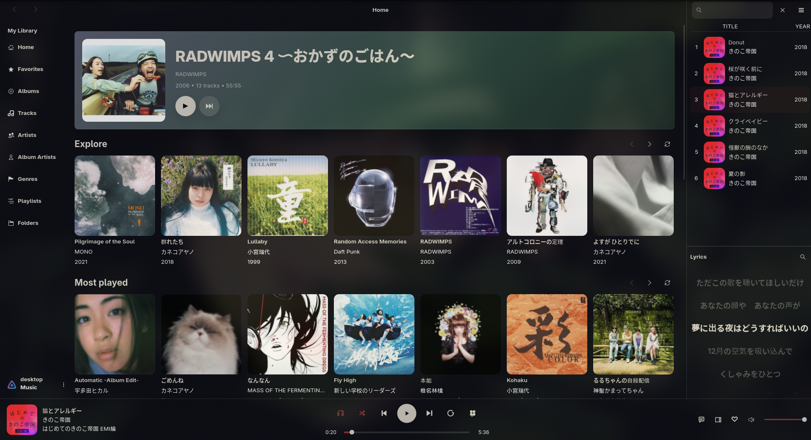
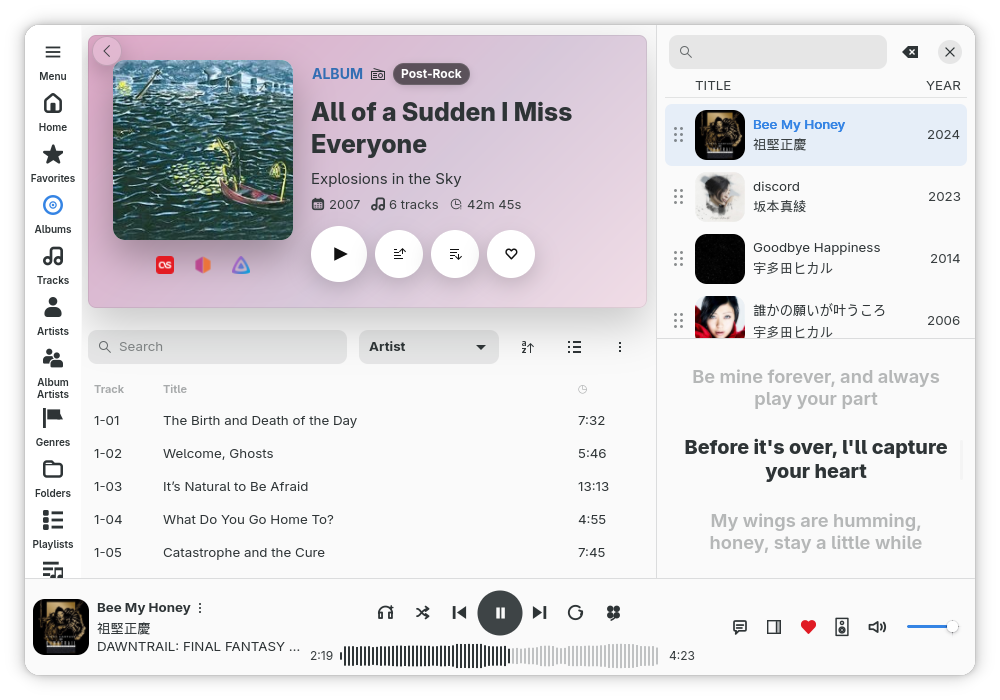
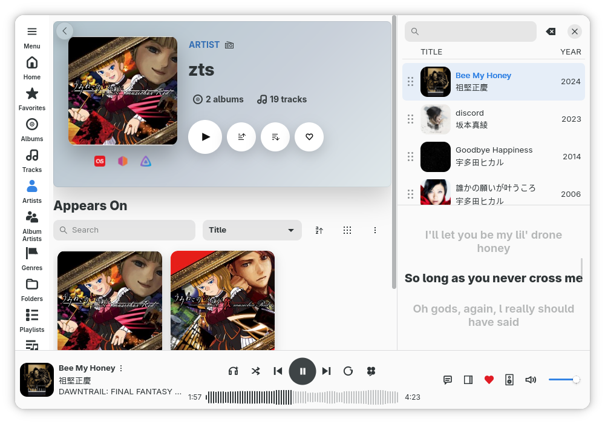
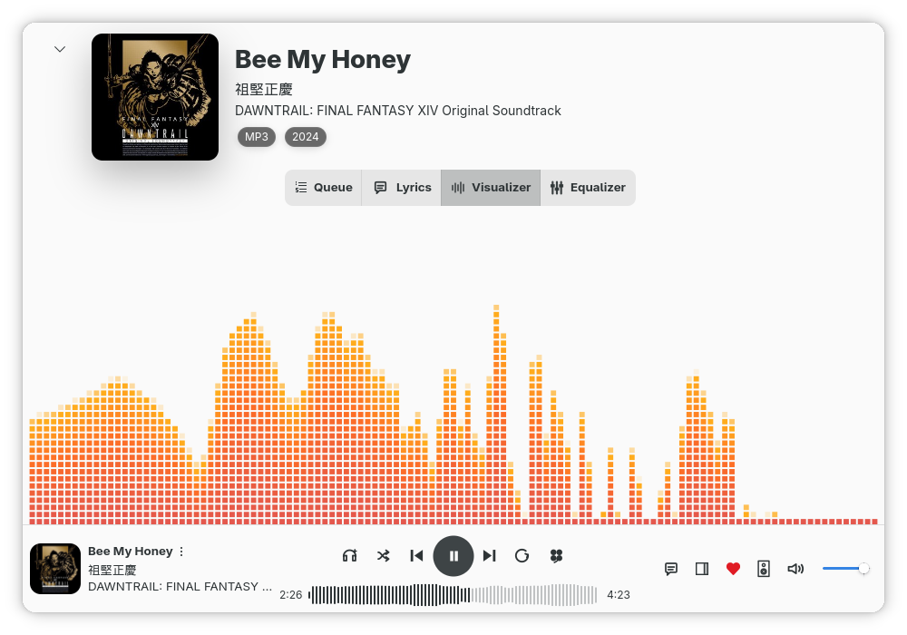
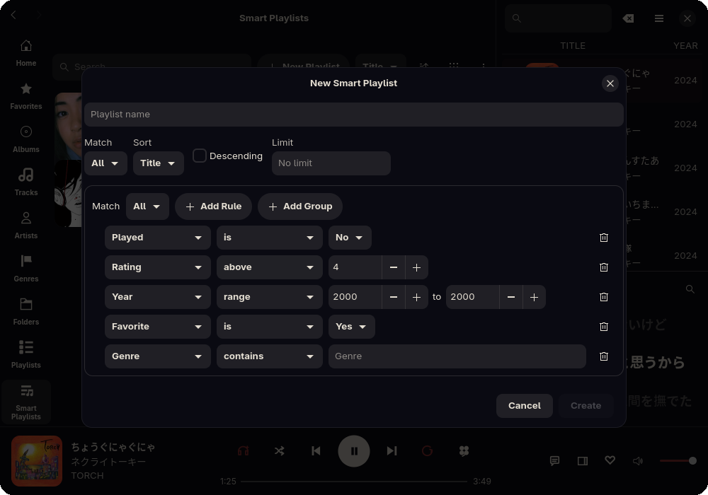
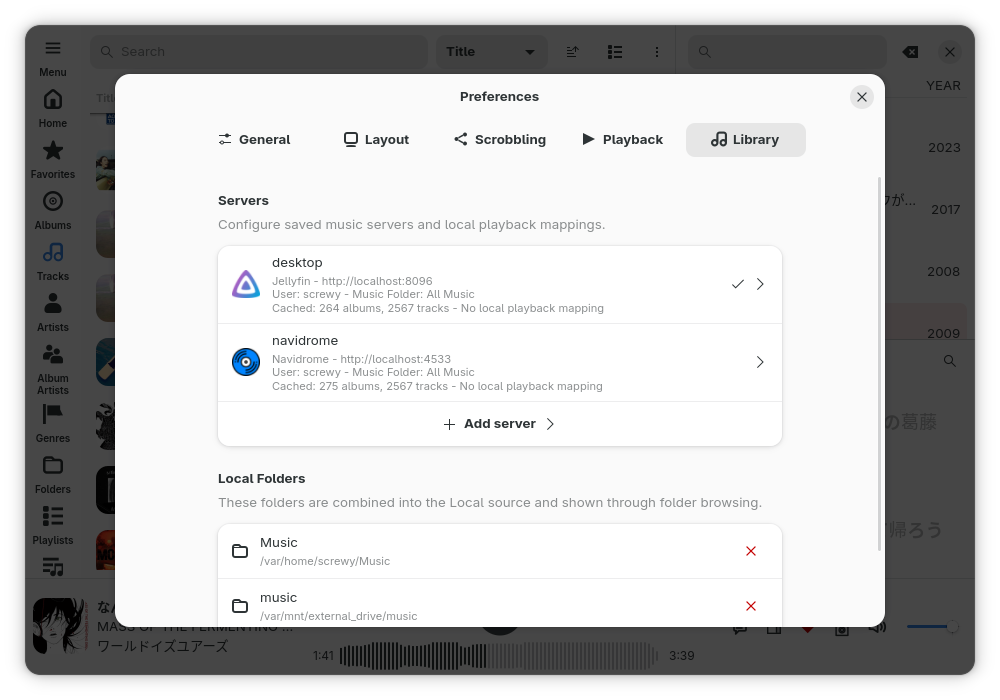
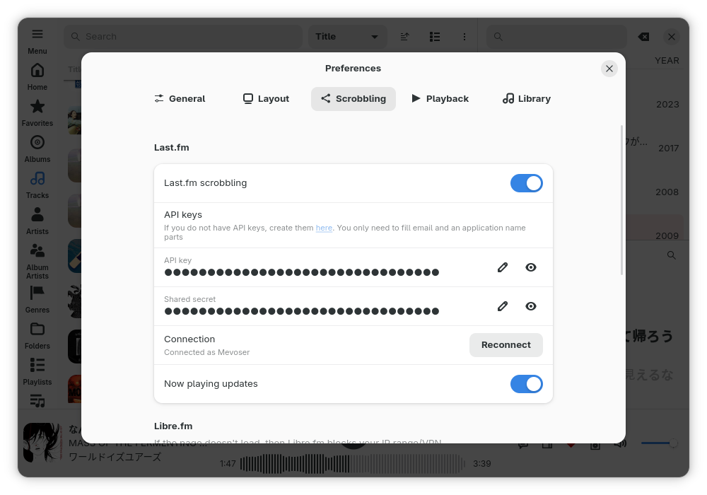
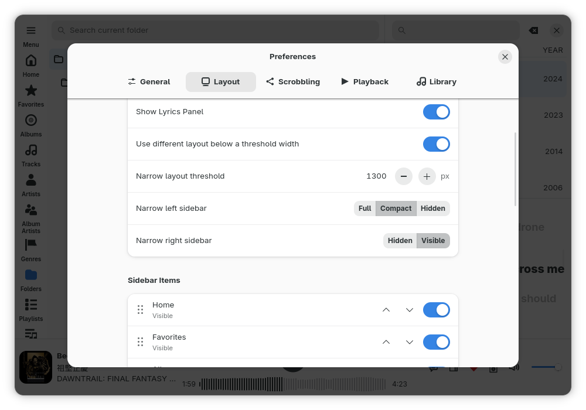
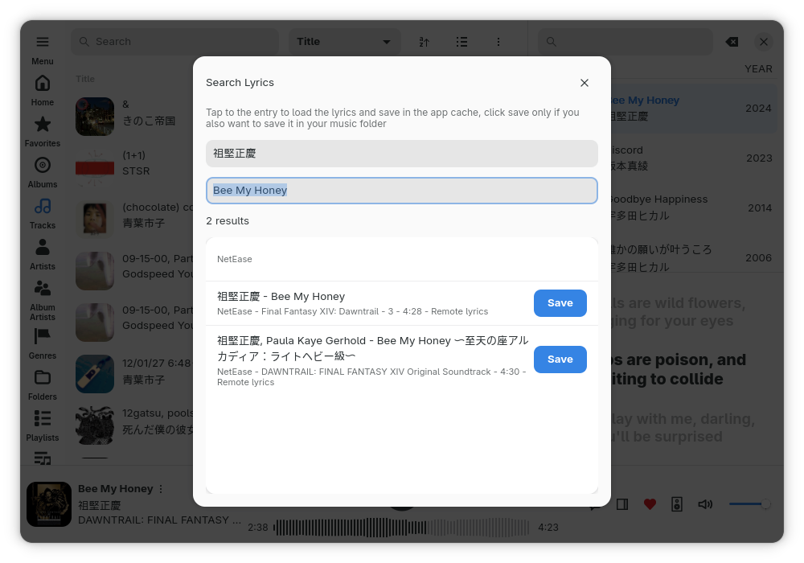

# Rufin

<p align="center">
  <a href="Cargo.toml"></a>
  <a href="LICENSE"></a>
  <a href="https://gitlab.gnome.org/GNOME/libadwaita/"></a>
  <a href="https://flathub.org/apps/io.github.screwys.Rufin"></a>
    <a href="https://aur.archlinux.org/packages/rufin"></a>
    <a href="https://search.nixos.org/packages?channel=unstable&query=rufin"></a>
</p>

 Rufin is a native, fast and easy to use GTK4/libadwaita music client written in Rust. It supports playback from your music server(s) or your local folder(s), with built-in playback reporting to Last.fm and alike.
<br clear="left">




# Features

- Fast, native and modern GTK/libadwaita client
- Built for Jellyfin, Subsonic, Navidrome servers and local folders
- Supports server-owned recommendation API for artists/tracks/albums/playlists/genres radios, so your plugins work
- Optimized for quick startup and navigation, smooth full library browsing
- Automatic metadata, artwork and lyrics caching
- Synchronized lyrics, built-in lyrics searcher that prioritizies synchronized lyrics
- Local library support with multiple folders and CUE support with separate playable tracks
- Moods tab, with ability to create smart playlists based on moods/BPM metadata for Navidrome, Subsonic and local libraries
- Built-in scrobbling for Last.fm, Libre.fm, and ListenBrainz
- Discord Rich Presence support
- Gapless playback, crossfade, ReplayGain, equalizer presets and fullscreen player with visualizer
- Ability to change audio devices with a simple button
- Fully usable in all window sizes, adjustable sidebar sizes that also support saving 2 different presets based on window sizes
- A different layout for smaller window sizes up to 450 x 400
- Expanding keyboard shortcuts catalog
- Rich customization while preserving GTK menus
- Smart playlists that support nested rules
- System tray integration
- Secure storage for all server credentials and API secrets
- Simple private mode for pausing external activity
- Best-effort path matching with your music server and local folders, you can play from your local files while keeping server reporting

# Library behavior

- Rufin creates a local cache for each source. This makes large libraries fast to load and normal to browse. Everything is a full page, they are not paginated. This is achieved by trying to keep everything in the local database, navigating to a page or scrolling through it doesn't parse data, scan folders or read the database for each entry.

- Cover arts are shared through the app. App warms visible and nearby covers in background, and keeps decoded covers in memory so the same image doesn't need to be decoded again for every page.

- Rufin stores source IDs, MusicBrainz IDs, sort tags and display names separately. It checks those before falling back to tag text from the same server or folder which helps to put albums on correct artist pages despite tag mismatches. Even if your tracks have missing Artist metadata, app can match it to an already existing artist. It still respects the new metadata if server source changes.

- When a library changes, app tries to update the changed parts instead of making every page reload. Cover arts and artist pictures come from source first and missing ones are tried to fetch online. Artists can use album arts as fallback and vice-versa, app tries to make sure everything has an image. Again, if source metadata changes, that is respected.

- If your server library also exists on disk, Rufin can play the local files directly while still reporting to the server.

# Screenshots











# Installation

## Flatpak
<p>
  <a href="https://flathub.org/apps/io.github.screwys.Rufin">
    
  </a>
</p>

## AUR

- AUR package is built from this repository at the same time with all releases. `rufin` for release binaries, `rufin-git` to build it from source

```bash
yay -S rufin
yay -S rufin-git
```

## Nix

Rufin is available in nixpkgs repository. To run Rufin without installing:

```bash
nix run nixpkgs#rufin
```

To add it to your profile:
```bash
nix profile install nixpkgs#rufin
```

We also publish release tag and `main` to Cachix. You can run `main` or an older release with:

```bash
nix run github:screwys/Rufin/main
nix run github:screwys/Rufin/vX.Y.Z
```

## Building locally

Dependencies:

- Rust 1.95 or newer, with Cargo
- just
- pkg-config or pkgconf
- gettext
- GTK 4.20 or newer
- libadwaita 1.8 or newer
- gdk-pixbuf
- GStreamer with the base, good, bad, ugly, and libav plugin sets

Arch Linux:

```bash
sudo pacman -S --needed \
  rust cargo just pkgconf gettext gtk4 libadwaita gdk-pixbuf2 \
  gstreamer gst-plugins-base gst-plugins-good gst-plugins-bad \
  gst-plugins-ugly gst-libav
```

Fedora:

```bash
sudo dnf install \
  rust cargo just pkgconf-pkg-config gettext gtk4-devel libadwaita-devel \
  gdk-pixbuf2-devel gstreamer1-devel gstreamer1-plugins-base-devel \
  gstreamer1-plugins-bad-free-devel gstreamer1-plugins-base \
  gstreamer1-plugins-good gstreamer1-plugins-bad-free
```

For full codec coverage, enable RPM Fusion and install `gstreamer1-plugins-ugly`
and `gstreamer1-plugin-libav`.

Distrobox or Toolbx is a good option if you want to keep these packages out of
your host system (Especially if you are on a Fedora Silverblue image like me).

If you have Nix available, dev shell would be the easiest option:

```bash
nix develop
```

For a debug run:

```bash
nix develop --command just debug
```

Since each `main` push builds cache, you can also set the shell to use it:

```bash
nix-shell -p cachix --run "cachix use rufin"
```

To build Rufin from source:

```bash
git clone https://github.com/screwys/Rufin.git
cd Rufin
just build
```

To run the source build:

```bash
just debug
```

# Troubleshooting

If you are experiencing a problem with the app, please open an issue and include logs. To run the app with extra debug logging:

```bash
flatpak run --env=RUST_LOG=FLAG_HERE io.github.screwys.Rufin 2>&1
```

or for native builds:

```bash
RUST_LOG=FLAG_HERE just debug
```

Where `RUST_LOG` flags are:

- `rufin=debug` enables app, UI, controller, and sync logs.
- `playback=debug` enables playback and GStreamer logs.
- `lofty=debug` enables metadata parser logs.

You can combine multiple `RUST_LOG` flags with `,`, for example `rufin=debug,playback=debug`.

For UI bugs, replace `RUST_LOG=FLAG_HERE` with `RUFIN_DEBUG_LAYOUT=1` or `RUFIN_RESIZE_DEBUG=1`.

# Project scope

## Not in scope

- **Integration with sources that are hostile to third party clients:** Not in scope due to technical and philosophical reasons. These easily make up the majority of known music apps. Support for these would allow a larger user base, but it would be a never ending battle with their API that they constantly break intentionally. This is not maintainable for an app in official repositories as even an immediate hotfix could take more than a day to deploy. 

- **Changing the operational performance significantly:** Rufin is meant to be a fast and visual client. Visual here refers to overall aesthethic; pages are meant to have covers here and there. The app keeps these covers in memory, up to a limit, to do less work of decoding again. Therefore it takes advantage of memory at all times. So far, it usually remains at 370~ MiB on a library with few thousand tracks, and it should not meaningfully go so much beyond on larger libraries. This is inline with other native clients with similar features, and significantly less than Electron-based clients that can easily use 1-1.5 GB. Therefore it can be `lightweight` in the sense that it tries to offer what these heavier apps do natively, though it is not lightweight like plenty of QT-based clients that can run with <100~ MiB memory usage. 

## In scope

- **Almost anything that doesn't collide with 3 points mentioned above:** This can be further polishment and feature request. If you go to closed issues, you will see that all feature requests have a follow-up PR so far, and I intend this to continue as long as it is feasible.

- **Integration with other self hosted services**: Rufin aims to be your own client truly. In future, there are plans for integration with other self-hosted scrobbling servers, or other controller servers to sync Rufin between different devices, directly under your own control.

- **More packaging alternatives**: Since this is a native client, we want to offer distribution specific packaging formats. As long as there is an active tester, these can be maintained officially from this repository.
  
- **Basic hardening for privacy and security:** See [SECURITY.md](SECURITY.md).

# Contributing

To contribute code, please see [CONTRIBUTING.md](CONTRIBUTING.md). 

## Translations

You can also contribute by translating the app on [Weblate](https://hosted.weblate.org/projects/rufin/app/)

[](https://hosted.weblate.org/engage/rufin/?utm_source=widget)

# Credits

Built with [GTK 4](https://www.gtk.org/), [libadwaita](https://gitlab.gnome.org/GNOME/libadwaita/), [gtk-rs](https://gtk-rs.org/) and [GStreamer](https://gstreamer.freedesktop.org/)

Rufin is greatly influenced by [Feishin](https://github.com/jeffvli/feishin), and a lot of design decisions are directly borrowed; as much we can achieve natively.

Player backend design and Smart Playlists are inspired from [Strawberry](https://github.com/strawberrymusicplayer/strawberry).

## Translation credits

- Estonian translation by Priit Jõerüüt
- Russian and Latvian translation by [aguhadug](https://github.com/aguhadug)
- German translation by [sevachka](https://github.com/sevachka)

# License

[LICENSE](LICENSE)
