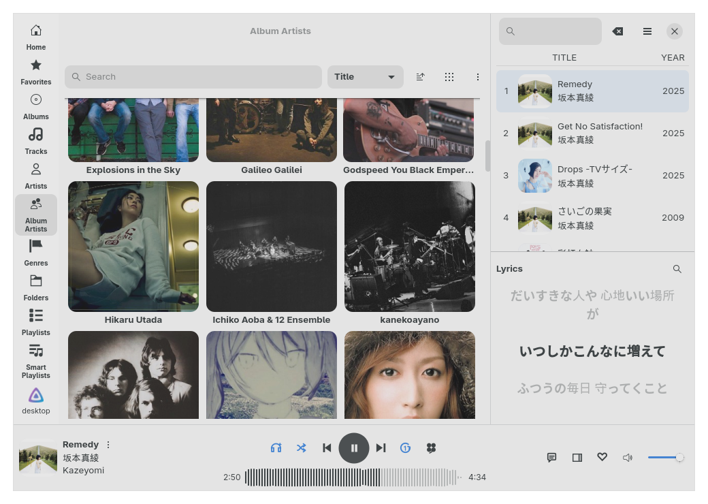
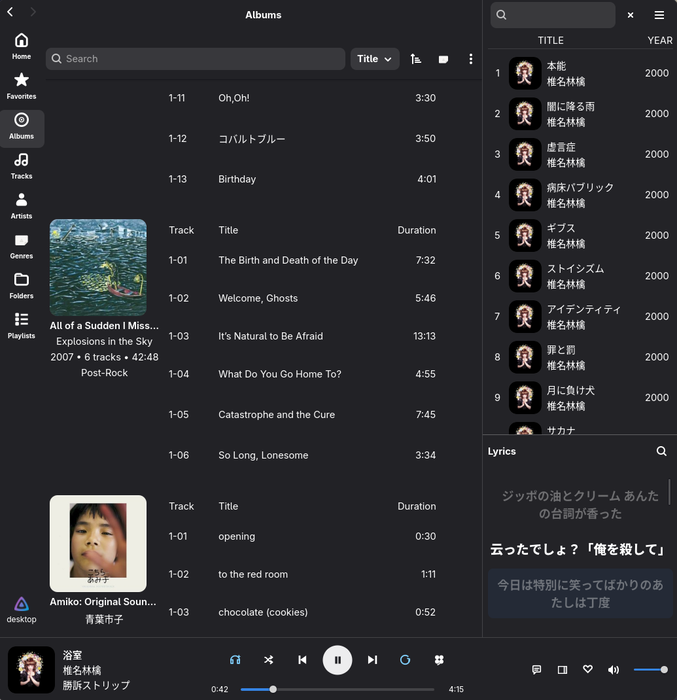
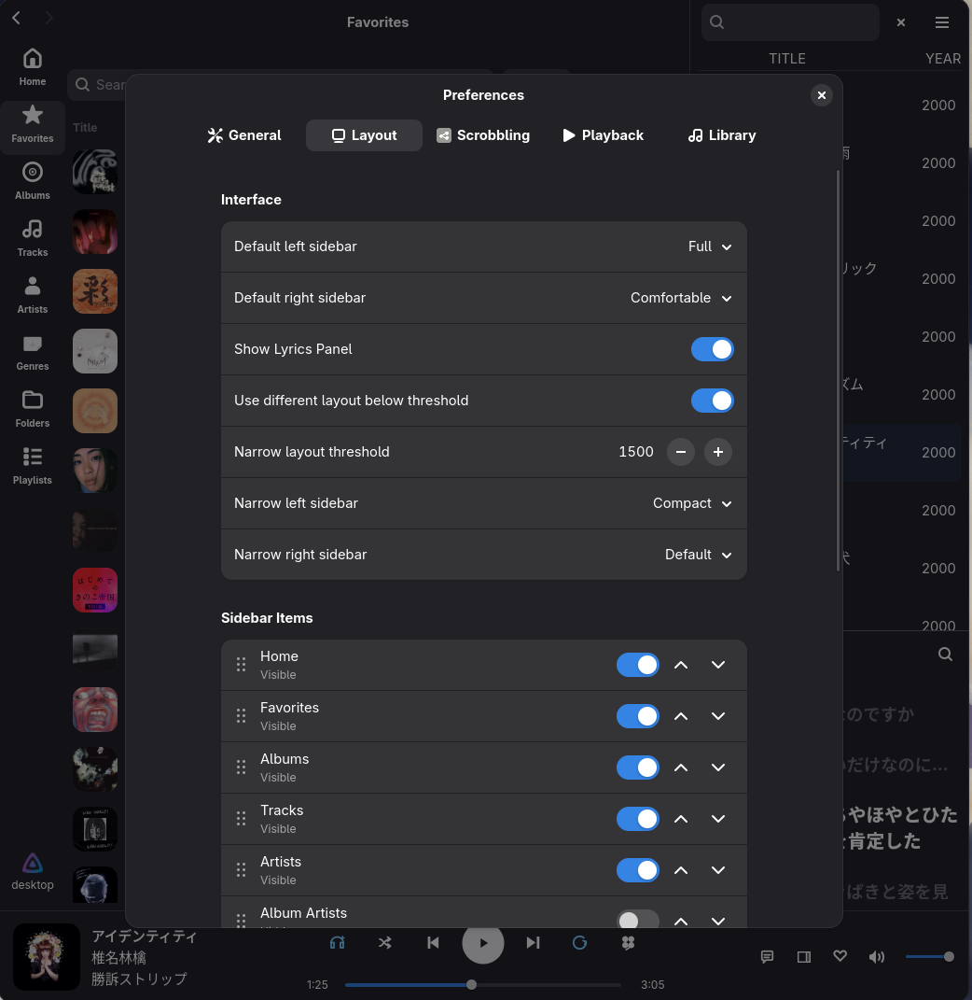
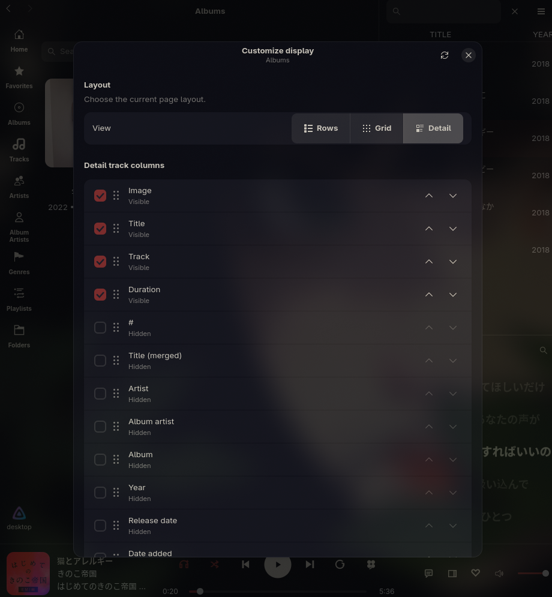
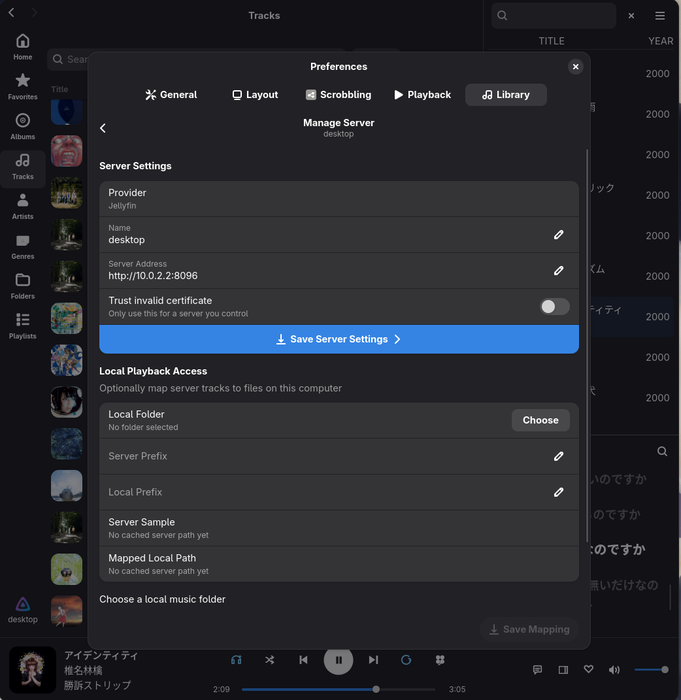

# Rufin

 Rufin is a native GTK4/libadwaita music client written in Rust. It is created to be a fast, lightweight and customizable music client. It supports playback from your music server(s) or your local folder(s), with built-in playback reporting to Last.fm and alike. [Now available in Flathub!](https://flathub.org/apps/io.github.screwys.Rufin)
<br clear="left">


# Features

- Lightweight, fast, native and modern client
- Supports playing Jellyfin, Subsonic, Navidrome servers and local folders
- Built-in scrobbling for Last.fm, Libre.fm, and ListenBrainz
- Discord Rich Presence support
- Automatic metadata caching for missing lyrics/cover arts 
- Music player basics like Gapless/Crossfade/ReplayGain/Equalizer 
- Best-effort path matching with your music server and local folders if enabled, you can play from your local files while keeping server reporting
- Rich customization while preserving GTK menus

# Screenshots


<p align="center">
  
  &nbsp;&nbsp;
  
</p>
<p align="center">
  
  &nbsp;&nbsp;
  
</p>
<p align="center">
  
  &nbsp;&nbsp;
  
</p>

# Installation

## Flatpak
<p>
  <a href="https://flathub.org/apps/io.github.screwys.Rufin">
    
  </a>
</p>

## AUR

- `rufin` for tagged binary releases, `rufin-git` to track this repository

```bash
yay -S rufin
yay -S rufin-git
```

## Nix

To use Rufin directly without building, run:

```bash
nix run github:screwys/Rufin
```
This downloads the binary through project cache. You can also add it to your profile:

```bash
nix profile install github:screwys/Rufin
```

## Building locally

To build it from source:

```bash
git clone https://github.com/screwys/Rufin.git
cd Rufin
cargo run -p rufin-app
```
## Contributing

You can contribute to the app by adding a new feature or translating the app. Please refer to [CONTRIBUTING.md](CONTRIBUTING.md)

## Development

Pass app flags after `--`, for example `cargo run -p rufin-app -- --ui-perf-observe`

```text
Usage: rufin [OPTIONS]
```

| Option | Usage |
| --- | --- |
| `--fake-scale <small\|large>` | Starts with a generated small or large fake library. |
| `--ui-perf-run` | Runs the automated startup, route, scroll, and artwork performance pass, then exits. |
| `--ui-perf-observe` | Records manual route reveal, scroll, and artwork performance while you use the app. |
| `--clear-cache` | Clears the active server cache and exits. |
| `--forget-active-server` | Removes the active server state and exits. |
| `-h`, `--help` | Prints command-line help. |

For tests:

```bash
cargo fmt --check
cargo test --workspace
```

UI perf reports default to `.local/perf/rufin-ui-perf-<pid>.log` for `--ui-perf-run` and `.local/perf/rufin-ui-observe-<pid>.log` for `--ui-perf-observe`.

## Credits

[GTK 4](https://www.gtk.org/)

[libadwaita](https://gitlab.gnome.org/GNOME/libadwaita/)

[gtk-rs](https://gtk-rs.org/) 

[GStreamer](https://gstreamer.freedesktop.org/)

This app is greatly influenced by [Feishin](https://github.com/jeffvli/feishin), both in client design and in how certain parts should work. It aims to bring a similar experience, altought not as feature-rich, to a native desktop app without a web stack.

# License

[LICENSE](LICENSE)
